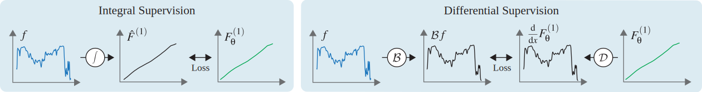

# Learning Neural Antiderivatives

This repository contains the official Python implementation of our paper:  
**[Learning Neural Antiderivatives](https://neural-antiderivatives.mpi-inf.mpg.de)**  



Neural fields offer continuous, learnable representations that extend beyond traditional discrete formats in visual computing. We study the problem of learning **neural representations of repeated antiderivatives** directly from a function, a continuous analogue of summed-area tables. Although widely used in discrete domains, such cumulative schemes rely on grids, which prevents their applicability in continuous neural contexts. We introduce and analyze a range of neural methods for repeated integration, including both adaptations of prior work and novel designs. Our evaluation spans multiple input dimensionalities and integration orders, assessing both reconstruction quality and performance in downstream tasks such as filtering and rendering. These results enable integrating classical cumulative operators into modern neural systems and offer insights into learning tasks involving differential and integral operators.


---

## Data

Download and extract the [data package](https://neural-antiderivatives.mpi-inf.mpg.de/data.zip) into the `data/` folder.  

The main directories are:  
- `motion/` — motion capture sequences.  
- `images/` — natural RGB images.  
- `envmap/` — environment map HDR images.  
- `geometry/` — signed distance functions.  
- `fd_blurred_gts/` — Monte Carlo ground truths for finite-difference (blurred supervision).  
- `dog_blurred_gts/` — Monte Carlo ground truths for smooth operators (blurred supervision).  
- `analytic_params/` — parameters for Gaussian and hyper-rectangle mixture functions.  

---

## Models

Pretrained models can be downloaded from [here](https://neural-antiderivatives.mpi-inf.mpg.de/trained_models.zip).  
Extract into the `models/` folder.  

---

## Usage

Each subfolder contains instructions for training models and reproducing experiments.  
Please refer to the respective README in:  
- `Integral/`  
- `AutoDiff/`  
- `Reduction/`  
- `FD/`  
- `DoG/`  

---

## Citation

If you find this work useful, please cite:  

```bibtex
@inproceedings{rubab2024antiderivatives,
  title = {Learning Neural Antiderivatives},
  author = {Fizza Rubab and Ntumba Elie Nsampi and Martin Balint and Felix Mujkanovic and
            Hans-Peter Seidel and Tobias Ritschel and Thomas Leimk{\"u}hler},
  booktitle = {Vision, Modeling, and Visualization},
  year = {2025}
}