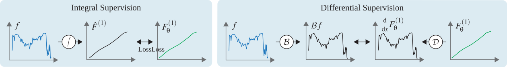

# Learning Neural Antiderivatives

This repository contains the official Python implementation of our paper:  
**[Learning Neural Antiderivatives](https://neural-antiderivatives.mpi-inf.mpg.de)**  



Neural fields offer continuous, learnable representations that extend beyond traditional discrete formats in visual computing. We study the problem of learning **neural representations of repeated antiderivatives** directly from a function, a continuous analogue of summed-area tables. Although widely used in discrete domains, such cumulative schemes rely on grids, which prevents their applicability in continuous neural contexts. We introduce and analyze a range of neural methods for repeated integration, including both adaptations of prior work and novel designs. Our evaluation spans multiple input dimensionalities and integration orders, assessing both reconstruction quality and performance in downstream tasks such as filtering and rendering. These results enable integrating classical cumulative operators into modern neural systems and offer insights into learning tasks involving differential and integral operators.

---

## Data

Download and extract the [data package](https://neural-antiderivatives.mpi-inf.mpg.de/data.zip).  
The archive contains two zip files: `data.zip` and `convolution_mc.zip`.  

- Extract **`data.zip`** into the `data/` folder.  
- Extract **`convolution_mc.zip`** into the `convolution_mc/` folder.  

 `data/`contains all datasets used for analytic, real, and geometric experiments.

- `motion/` — motion capture sequences.  
- `images/` — natural RGB images.  
- `envmap/` — HDR environment maps for lighting tasks.  
- `geometry/` — 3D geometry and signed distance functions (SDFs).  
- `fd_blurred_gts/` — Monte Carlo ground truths for **finite-difference** blurred supervision.  
- `dog_blurred_gts/` — Monte Carlo ground truths for **Derivative of Gaussian (DoG)** blurred supervision.  
- `analytic_params/` — stored parameters for analytic Gaussian and hyper-rectangle mixtures.  


`convolution_mc/` contains **reference ground truths** for the convolution experiments.

- `images/` — natural RGB images.  
- `envmap/` — HDR environment maps.  
- `geometry/` — signed distance fields for 3D shapes.  

---

## Models

Pretrained models can be downloaded from [here](https://neural-antiderivatives.mpi-inf.mpg.de/trained_models.zip).  
Extract the contents into the `models/` directory.

After extraction, your `models/` folder should contain the following subdirectories:

- `envmodels/` — pretrained environment map models.  
- `AutoDiff/` — models trained using Automatic Differentiation (AD).  
- `Reduction/` — models trained using AD with Reduction.  
- `Integral` — models trained using Integral Supervision.
- `DoG-Noblur/` — Derivative of Gaussian (DoG) models trained **without blur**.  
- `DoG-Blur/` — Derivative of Gaussian (DoG) models trained **with blur**.  
- `FD-Noblur/` — Finite Difference (FD) models trained **without blur**.  
- `FD-Blur/` — Finite Difference (FD) models trained **with blur**.  

---

## Usage

Each subfolder contains instructions for training models and reproducing evaluation and convolution experiments. Please refer to the respective READMEs.

The `Rendering/` folder contains code with individual rendering files for each method.

---

## Environment

# Environment Setup

Below are the recommended steps to set up your environment.

```bash
conda create -n neural-antiderivatives python=3.10
conda activate neural-antiderivatives
pip install torch==2.6.0+cu124 torchvision torchaudio --index-url https://download.pytorch.org/whl/cu124
conda install numpy imageio click
conda install -c conda-forge opencv matplotlib pillow cupy
conda install -c fastai opencv-python-headless
pip install decord functorch plyfile pysdf scikit_image scipy scikit-image scikit-learn 
pip install trimesh jax jaxlib tensorboard open3d
pip install simpleimageio lpips librosa tqdm
pip install pyopengl pyglet glfw click
```

---

## Citation

If you find this work useful, please cite:  

```bibtex
@inproceedings{rubab2024antiderivatives,
  title = {Learning Neural Antiderivatives},
  author = {Fizza Rubab and Ntumba Elie Nsampi and Martin Balint and Felix Mujkanovic and
            Hans-Peter Seidel and Tobias Ritschel and Thomas Leimk{\"u}hler},
  booktitle = {Vision, Modeling, and Visualization},
  year = {2025}
}